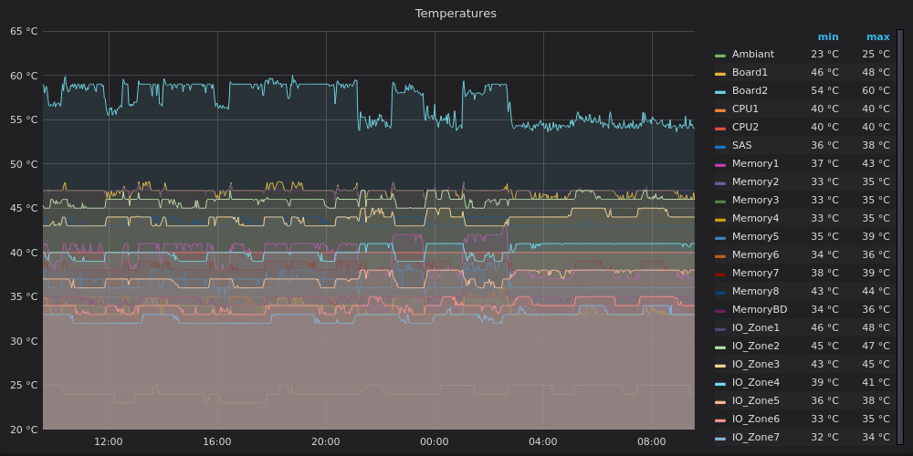
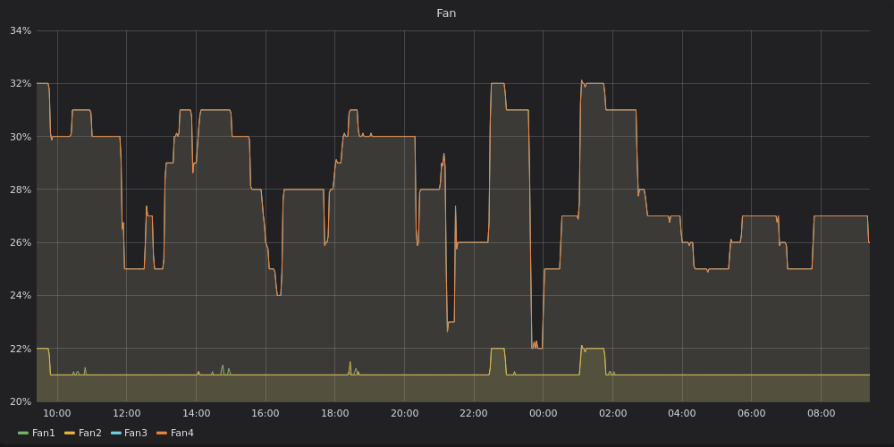

# collectd_scripts
Scripts for collectd : HP Proliant G6, ping, ZFS

## hp-asmcli-*
Uses hpasmcli to read :
Fans
Power usage (power meter in PSU)
Temperatures (22 readings)

## hp-ssacli-array.sh
To monitor the array, but work in progress (stand-still).

## ping.sh
You can ping a few hosts with this script. The build-in ping doesn't match the system pings.

## zfs.sh
This is also in progress but can report : 
```
in bytes :
  pool size
  pool allocated
  pool free space
  pool scrubed
  pool scrub repaired
in % :
  pool usage
  pool unused
  pool scrubed % (TODO)
in boolean (1=ok, 2=BAD)
  pool health
in bytes/sec:
  pool scrub speed
in time:
  pool scrubed total time
in int:
  pool scrub repaired errors
  ```
  
  Usage :
In /etc/collectd/collectd.conf:
```
<Plugin exec>
        Exec "daemon" "/usr/local/bin/ping.sh" "8.8.8.8" "google.com" "opendns.com" "80.80.80.80"
        Exec "daemon" "/usr/local/bin/hp-asmcli-temp.sh"
        Exec "daemon" "/usr/local/bin/hp-asmcli-fans.sh"
        Exec "daemon" "/usr/local/bin/hp-asmcli-pwr.sh"
        Exec "daemon" "/usr/local/bin/zfs.sh"
</Plugin>
```

###Results :

hp-asmcli-temp.sh

hp-asmcli-pwr.sh

hp-asmcli-fan.sh


ping.sh


zfs.sh


# The folder grafana 
It contains my json to import the grap query.
You will need rename the hostname to your own.

